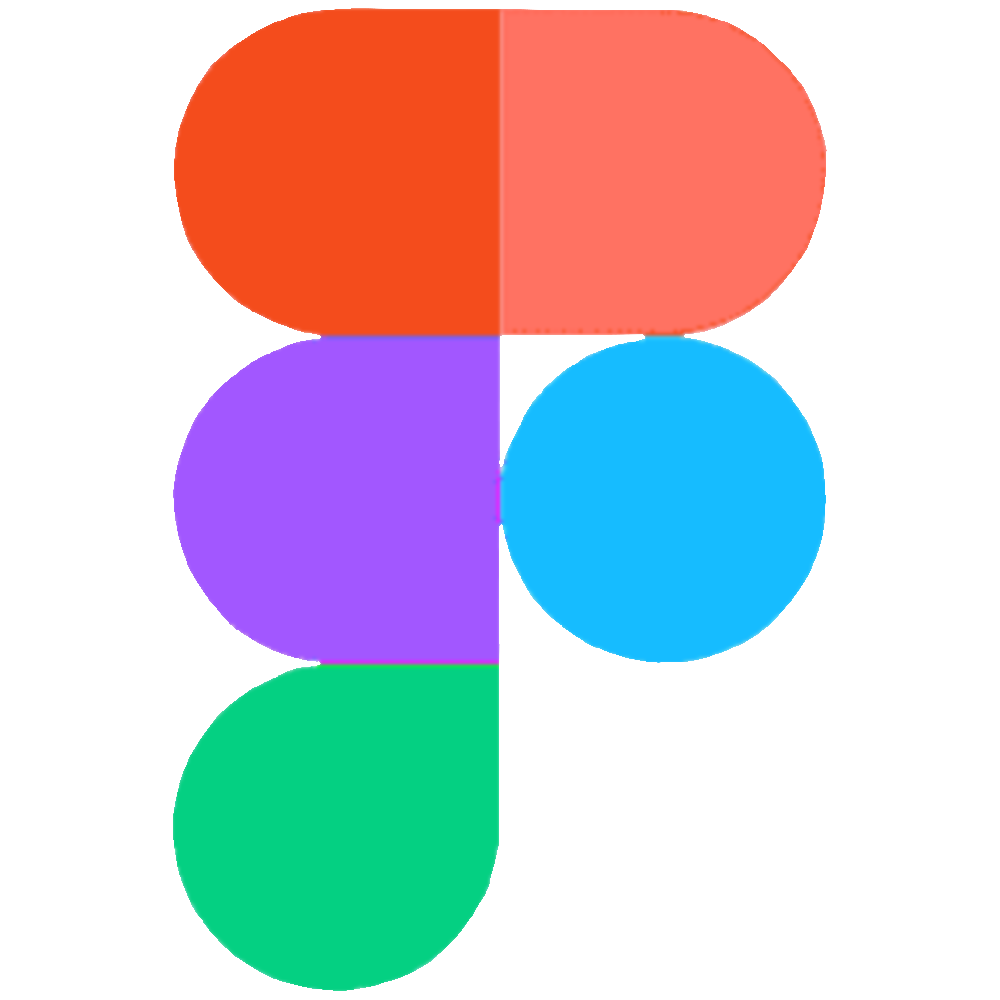

    <!-- Заголовок -->
    

        
    

    

        
    

    <!-- Контакты -->
    

        &nbsp;
        &nbsp;
        
    

    <!-- Стек -->
    

        &nbsp;
        &nbsp;
        &nbsp;
        &nbsp;
        &nbsp;
        &nbsp;
        &nbsp;
        &nbsp;
        &nbsp;
        &nbsp;
        &nbsp;
        &nbsp;
        &nbsp;
        &nbsp;
        &nbsp;
        &nbsp;
    

<table align="center" cellspacing="0" cellpadding="0" border="0">
    <tr style="background-color: transparent">
        <td>
            <!-- GitHub Profile Trophy -->
            

                <picture>
                    <source
                        srcset="https://github-profile-trophy.vercel.app/?username=mary-an-safronova&no-frame=true&no-bg=true&theme=algolia&row=2&column=3"
                        media="(prefers-color-scheme: dark)"
                    />
                    <source
                        srcset="https://github-profile-trophy.vercel.app/?username=mary-an-safronova&no-frame=true&no-bg=true&theme=algolia&row=2&column=3"
                        media="(prefers-color-scheme: light), (prefers-color-scheme: no-preference)"
                    />
                    
                </picture>
            

        </td>
        <td>
            <!-- GitHub Streak Stats -->
            

                <picture>
                    <source
                        srcset="http://github-readme-streak-stats.herokuapp.com?user=mary-an-safronova&theme=transparent&hide_border=true"
                        media="(prefers-color-scheme: dark)"
                    />
                    <source
                        srcset="http://github-readme-streak-stats.herokuapp.com?user=mary-an-safronova&theme=transparent&hide_border=true"
                        media="(prefers-color-scheme: light), (prefers-color-scheme: no-preference)"
                    />
                    
                </picture>
            

        </td>
    </tr>
    <tr style="background-color: transparent !important">
        <td style="padding: 0">
            <!-- GitHub Stats -->
            

                <picture>
                    <source
                        srcset="https://github-readme-stats-skyz.vercel.app/api?username=mary-an-safronova&show_icons=true&theme=github_dark&hide_border=true"
                        media="(prefers-color-scheme: dark)"
                    />
                    <source
                        srcset="https://github-readme-stats-skyz.vercel.app/api?username=mary-an-safronova&show_icons=true&theme=github_dark&hide_border=true"
                        media="(prefers-color-scheme: light), (prefers-color-scheme: no-preference)"
                    />
                    
                </picture>
            

        </td>
        <td style="padding: 0">
            <!-- Most Used Languages -->
            

                <picture>
                    <source
                        srcset="https://github-readme-stats-skyz.vercel.app/api/top-langs/?username=mary-an-safronova&layout=compact&theme=github_dark&hide_border=true"
                        media="(prefers-color-scheme: dark)"
                    />
                    <source
                        srcset="https://github-readme-stats-skyz.vercel.app/api/top-langs/?username=mary-an-safronova&layout=compact&theme=github_dark&hide_border=true"
                        media="(prefers-color-scheme: light), (prefers-color-scheme: no-preference)"
                    />
                    
                </picture>
            

        </td>
    </tr>
</table>
